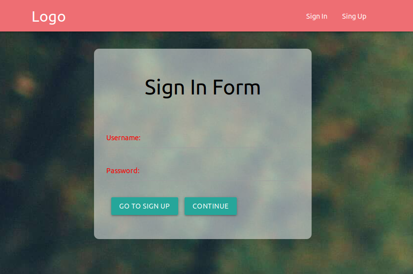

# Login-NodeJs-MySQL-PassportJs
This is a Login with Forms to Sign In and Sign Up



## Description
Este login tiene los features de Crear usuarios, Encriptar sus contraseñas con EncryptJs y guardarlos en una base de datos con MySQL, Se podra loguear buscando el Username ingresado y despues comparando la contraseña encriptada que esta en la base de datos con la insertada recientemente, Se recibira mensajes Flash para asi mostrar al usuario su Login Success o su Login Error

### Languages, Technologies & Libraries Used
* HTML5
* CSS3
* Materialize 1.0.0
* JavaScript
* NodeJs
* Express
* MySQL
* Morgan
* Nodemon
* DotEnv
* Handlebars
* BcryptJs
* Passport
* Flash
# Managing Environment Variables

With dotenv, you can define all of your variables in a .env file.
```ruby
DB_HOST=localhost
USER=sam
```
Then, dotenv will assign new keys to process.env and leave existing values untouched.
```ruby
require("dotenv").config();

console.log(process.env.USER); // => max
console.log(process.env.DB_HOST); // => localhost
```
 **************************************************** 
 # .env 
 Debemos crear un archivo  ".env"  en el directorio raiz del proyecto y en el
 agregar, cambiando solamente el valor de las variables por las nuestras , lo siguiente:
 
 ```ruby
 
 DB_HOST=localhost
DB_USER=you_name
DB_PASS=you_password
DB_NAME=newprogrammers

```
 
